# Minik8s

[[English]](https://github.com/Kami-code/minik8s/blob/master/README.md) [[中文简体]](https://github.com/WilliamX1/minik8s/blob/master/README.md)

Minik8s is a mini container orchestration tool similar to [Kubernetes](https://kubernetes.io/), which can manage containers that meet the CRI interface on multiple machines. It supports basic functions such as container lifecycle management, dynamic scaling, automatic scaling, and provides serverless platform integration based. 

The specific requirements can be referred to the following requirement document.

- [Minik8s basic requirements](./doc/Minik8s-basic-requirements.pdf)

- [Minik8s acceptance criteria](./doc/Minik8s-acceptance-criteria.pdf)


>  All video demonstrations mentioned in this project are available for viewing and download on [Google Drive](https://drive.google.com/drive/folders/1WIHG2nCDOIMy4DTylEe37e8E_3EXKwk6?usp=sharing).
>

Team Leader: Chen Bao @ [Kami-code](https://github.com/Kami-code)

Team Member: Huidong Xu @ [WilliamX1](https://github.com/WilliamX1)

Team Member: Yixiang Liu @ [liuyixiang42](https://github.com/liuyixiang42)

## Table of Contents

- [Architecture](#Architecture)
  - [Overall Architecture](#Overall Architecture)
  - [Software Stack](#Software Stack)
  - [Design Principle](#Design Principle)
- [Directory Structure](#Directory Structure)
- [Installation](#Installation)
- [Usage](#Usage)
  - [Deploying Minik8s on Multiple Hosts ](#Deploying Minik8s on Multiple Hosts )
  - [Running Pods and Monitoring the Lifecycle of Containers](#Running Pods and Monitoring the Lifecycle of Containers)
  - [Running and Access Service with Virtual IP Address](#Running and Access Service with Virtual IP Address)
  - [Running Replica Set on Pods](#Running Replica Set on Pods)
  - [Running Auto Scaling on ReplicaSet](#Running Auto Scaling on ReplicaSet)
  - [Forwarding using DNS](#Forwarding using DNS)
  - [Running GPU Applications](#Running GPU Applications)
  - [Run Serverless Cloud Functions](#Run Serverless Cloud Functions)
  - [Using Serverless DAG to Specify Transition Condition and Path](#Using Serverless DAG to Specify Transition Condition and Path)
- [References](#References)

## Architecture

### Overall Architecture

The architecture view of Minik8s is shown below, which mainly refers to the Minik8s best practice architecture provided in class. It can be divided into three parts: user space, control plane, and worker nodes.

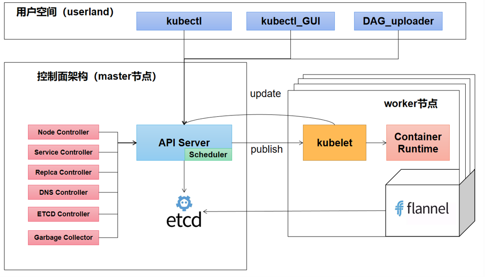

In the user space, we provide three executable scripts for users to meet different needs. These three scripts will eventually make requests to the API server, which schedules and forwards them according to corresponding logic. We have provided numerous controllers to monitor the corresponding states. For kubelet's requests, the API server will forward them to the corresponding worker.

In terms of multi-node deployment, each worker is configured with Flannel, which connects the IP allocation and forwarding across multiple nodes.

### Design Principle

We deploy in a master-worker node pattern which is not limited to virtual machines, but rather a logical concept where a single host can act as both master and worker nodes. 

On the master node, we need to run `/master/api_server.py` for interacting with various components, `/master/replica_set_controller.py` for handling requests pertaining to `ReplicaSet`, `/master/service_controller.py` for handling requests pertaining to `Service`, `/master/dns_controller.py` for handling requests related to `Dns`, and `/master/garbage_collector.py` for recovering failed request garbage information. 

On the worker node, we only need to run `/worker/kubelet_flask.py` to handle requests sent by the master node. We can also interact with the cluster through the command line by running `/userland/kubectl.py`. 

This master-worker node setting makes it very easy for multiple machines (not limited to 2) to collectively form a cluster.

## Directory Structure

- `/.workflow`: CI/CD config file

- `/doc`: project documents

- `/helper`: global parameters and functions

  - `const.py`: global parameters, including some directory paths
  - `utils.py`: global functions, mainly including the function to change the item of iptables
  - `yaml_loader.py`: functions to load `yaml` file

- `/master`: directory for master node

  - `/dns`: DNS forwarding using Nginx Service
    - `/nginx`
      - `/conf`: map to `/etc/nginx/conf.d/` of the Nginx container, producing `*.conf`  when DNS is created.
      - `/html`: map to `/usr/share/nginx/html/`of the Nginx container. 
      - `/log`: map to `/var/log/nginx` of the Nginx container, producing error log for debug.
    - `dns-nginx-server-replica-set.yaml`: The basic information YAML file for Nginx, such as the number of Pods.
    - `dns-nginx-server-service.yaml`: The basic information YAML file for the Nginx service, such as the virtual IP address and exposed port of the service.
  - `api_server.py`: The `api server` of minik8s uses Flask to implement inter-network communication and uses Etcd for persistent storage.
  - `dns_controller.py`: the Dns processor of minik8s, responsible for creating, updating, and deleting user-uploaded Dns records.

  - `etcd_controller.py`: the etcd daemon used by minik8s for fault tolerance.
  - `garbage_collector.py`: the garbage collector of minik8s, responsible for recovering failed Pod scheduling.
  - `node_controller.py`: the Node processor of minik8s, responsible for adding and deleting nodes.
  - `replica_set_controller.py`: the Replicaset processor of minik8s, responsible for creating, scheduling, and deleting user-uploaded ReplicaSets.
  - `serverless.py`: the Serverless implementation logic of minik8s.
  - `service_controller.py`: the Service processor of minik8s, responsible for creating, updating, and deleting user-uploaded Services.

- `/useland`: directory for the user

  - `/final_check`: directory for final release, including some `yaml` files for demonstrations
  - `/frontend`: the front-end used to demonstrate Serverless.
  - `/gpu`: the GPU support part of minik8s.
  - `/parameters`: the yaml file parameters for GPU demonstration at final defense.
  - `/user_serverless_scripts`: the add and multiply scripts for GPU.
  - `/yaml_default`: the user-defined `yaml` files.
  - `kubectl.py`: the user interactive command line of minik8s.
  - `kubectl_gui.py`: the user graphical interactive interface of minik8s, mainly used for selecting and uploading `yaml` files.

- `/worker`: directory for worker node

  - `/HPA_test_docker` 
  - `/gpu`: code supporting GPU applications
  - `/multi_machine` 
    - `/configs`: the config of `Flannel`, which can be used as the subnet for allocating global IP addresses, and the default is `20.20.0.0/16`. 
    - `/etcd`: `etcd` for persistent storage
    - `/scripts`: some `shell` scripts, mainly used to config `Flannel` and `Docker` when starting `kubelet_flask`
  - `/nodes_yaml`: the `yaml` file for user to define `node` 
  - `/sources`: some resources
  - `entities.py`: some abstraction class
  - `kubedns.py`: functions for DNS and forwarding
  - `kubelet_flask.py`: functions to run the worker like k8s
  - `kubeproxy.py`: utility functions for Service

- `requirements.txt`: project package requirements

- `run.sh`: CI/CD running scripts

## Installation

1. Make sure your node is connected to the Internet and can be accessed via the intranet, and install [Docker](https://docs.docker.com/engine/install/) and [Anaconda](https://docs.anaconda.com/anaconda/install/linux/).
2. Configuring Security Group. Add inbound and outbound rules for IP segments to prevent network requests from being blocked. For example, add inbound and outbound rules for `192.168.0.0/16`, `172.17.0.0/16`, and `20.0.0.0/8`.
3. Configure the  `conda` environment and activate it.

```bash
$ conda create -n minik8s python=3.8
$ conda activate minik8s
$ vim ~/.bashrc
$ source ~/.bashrc
```

3. Clone this repository and install the required packages.

```bash
$ git clone https://gitee.com/Leimak/minik8s
$ cd minik8s
$ git checkout -b master origin/master
$ pip uninstall protobuf
$ pip install -r requirements.txt
```

## Usage

### Deploying Minik8s on Multiple Hosts 

[[Video Demonstration]](https://drive.google.com/file/d/1OrlWpDiY6zEPDTesxSbV6EwUqZNK9XdJ/view?usp=sharing)

We use Flask for network communication to implement message passing between worker nodes and master nodes, and use Flannel + etcd to ensure that the IP addresses assigned to Pods on multiple hosts are globally unique.

We deploy two virtual machines, where "minik8s-1" serves as both the master and worker node, while "minik8s-2" only serves as a worker node.

| Node Type | Hostname | Private IP Address | Floating IP Address |
| :--: | :--: | :--: | :--: |
| master + worker | minik8s-1 | 192.168.1.12 | 11.119.11.120 |
| master | minik8s-2 | 192.168.1.5 | 11.119.10.16 |

The configuration file for the master node,  `/worker/multi_machine/nodes_yaml/master.yaml` , is shown below with explanations in comments. 

```yaml
ETCD_NAME: etcd  # the name of etcd, --name etcd
IP_ADDRESS: http://10.119.11.120  # the floating IP address of node running etcd
ETCD_INITIAL_CLUSTER: etcd=http://10.119.11.120:2380  # etcd initial cluster
ETCD_INITIAL_CLUSTER_STATE: new  # the state of etcd
API_SERVER_URL: http://192.168.1.12:5050  # the IP address of api server
```

The configuration file for the worker node,  `/worker/multi_machine/nodes_yam/worker1.yaml` , is shown below with explanations in comments. 

```yaml
MASTER_ETCD_CLIENT_URL: http://10.119.11.120:2379  # the ip of master
IP_ADDRESS: http://10.119.11.120  # the floating ip of each worker
API_SERVER_URL: http://192.168.1.12:5050  # master api server 的 ip
WORKER_PORT: 5051  # the port of worker
```

Before running, we can execute `/worker/multi_machine/scripts/clean-shell.sh` to clean up any residual `etcd`, `flannel`, and `docker` processes that may be present in the system.

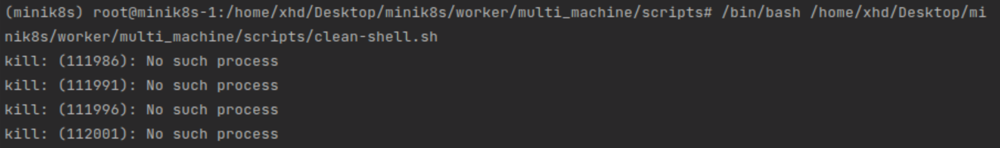

After ensuring that there are no related processes, we first run the API server on `minik8s-1`. The screenshot below shows that the master is running at `127.0.0.1:5050` on this machine and at `192.168.1.12:5050` on other machines, indicating that the API server has been successfully started.

```shell
$ python3 ./master/api_server.py
```

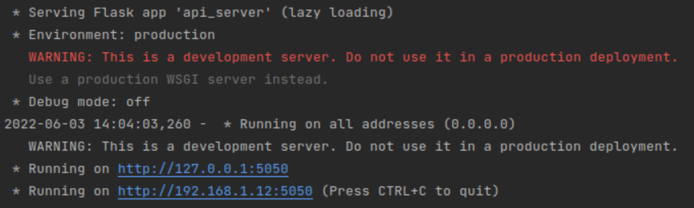

Next, we will run `kubelet_flask.py` on two virtual machines separately and pass the configuration file as a parameter. It can be seen that the two workers are running on port `5051` on their respective machines, which corresponds with the `WORKER_PORT` in the Node configuration file, indicating that joining the cluster was successful.

```shell
$ python3 ./worker/kubelet_flask.py worker1 # run on minik8s-1
$ python3 ./worker/kubelet_flask.py worker2 # run on minik8s-2
```

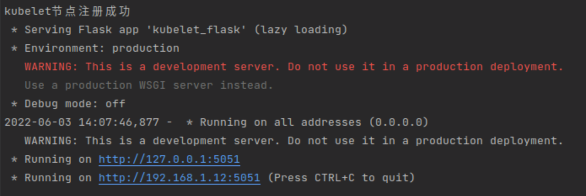

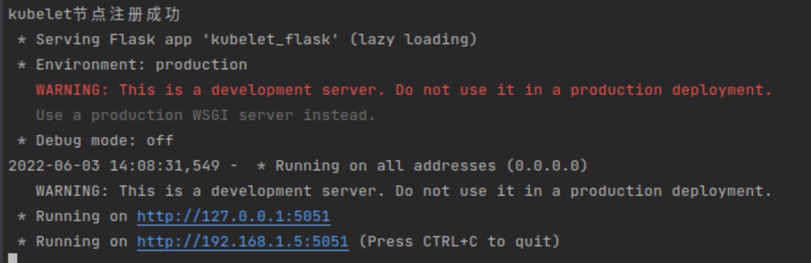

We run `/userland/kubectl.py`  to interact with the cluster via the command line, and use the  `show nodes` command to obtain the status of the Node, including the unique identifier  `name`,  current status `Running`, current IP `working_url`,  current virtual memory `total_memory` , current memory usage rate `memory_use_percent` and CPU usage rate `cpu_use_percent`.

```shell
$ python3 ./userland/kubectl.py
>>> show nodes
```

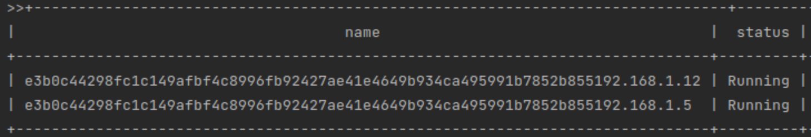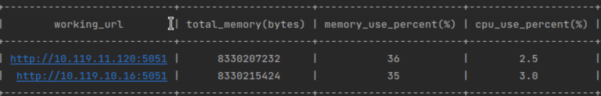

Since now, the multi-node deployment has been completed.

### Running Pods and Monitoring the Lifecycle of Containers

[[Video Demonstration1]](https://drive.google.com/file/d/1Jic0tluvHfZOHbcJxuxFfEDIOWNQ9Zhl/view?usp=sharing), [[Video Demonstration2]](https://drive.google.com/file/d/1CFBIjBUQfWzz1-yz5cm_KI7mH9lVqPbF/view?usp=sharing), [[Video Demonstration3]](https://drive.google.com/file/d/13sgXwQbWwndUX0AbW3Ha9ZXaWuXgA7Ld/view?usp=sharing), [[Video Demonstration4]](https://drive.google.com/file/d/12d4QORtS8_k9p3kkXgQJ3ayms4z7X3Ke/view?usp=sharing)

As the smallest scheduling unit in minik8s, `Pod` is a collection of multiple Docker containers. Therefore, we designed a Pod class to more clearly describe and store `Pod` information and use `Python Docker SDK` to start specific containers.

In terms of networking, we additionally start a pause container for each `Pod`. All user-defined containers share the network stack with this pause container which enables network communication between different containers.

We can use `kubectl` to upload and create Pods through commands, or we can use `kubectl_gui` to upload and create Pods with a graphical interface. Both methods will verify whether the file path exists and whether the contents in the YAML file are valid. Note that we use the `$` symbol to represent the root directory of the project, which in this case is `/home/xhd/Desktop/minik8s/`.

```shell
>>> start -f $/userland/final_check/pod-1.yaml
```

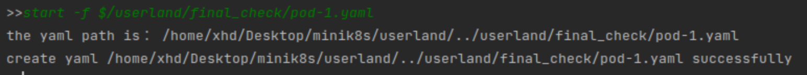

We can use `kubelet` to run the `show pods` command to view the abstract configuration of Pods, which includes the Pod's name (`name`), globally unique `instance_name`, running status (`status`), creation time (`created time`), globally unique IP address, mounted data volume (`volume`), exposed ports (`ports`), total CPU limit (`cpu`), total memory limit (`mem`), and the node to which it is assigned (`Node`).

```shell
>>> show pods
```

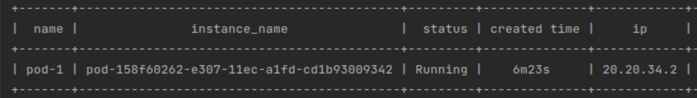

When checking the actual running status of the containers, we found that the user-defined `nginx`, `jetty` and `busybox` containers have all started successfully. Furthermore, we can see that the `busybox` image executed the user-defined `sh -c 'sleep 360000000'` command.

```shell
$ docker ps -a
```

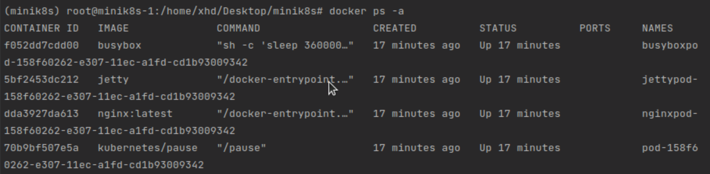

The [Nginx container](https://hub.docker.com/_/nginx) exposes port 80, and the [Jetty container](https://hub.docker.com/_/jetty) exposes port 8080. We can use `curl` between these two containers to verify communication between multiple containers within the Pod using `localhost`. Note that Jetty is like Tomcat, used for quickly compiling and deploying WAR files. As we are running an empty Jetty container here, its homepage displays the text "Error 404 - Not Found". This also means that we can access this port through the local network since the corresponding HTML source code would not appear if it was not accessible.

```shell
$ docker exec nginx-xxxx curl localhost:80
$ docker exec nginx-xxxx curl localhost:8080
$ docker exec jetty-xxxx curl localhost:80
$ docker exec jetty-xxxx curl localhost:8080
```

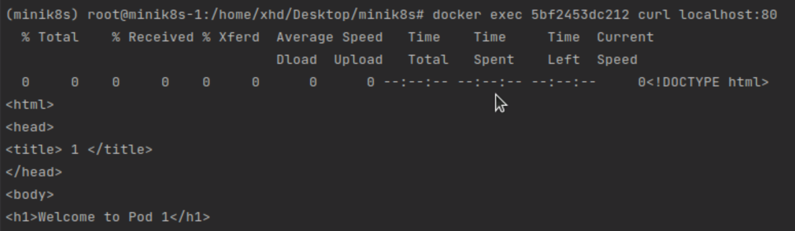

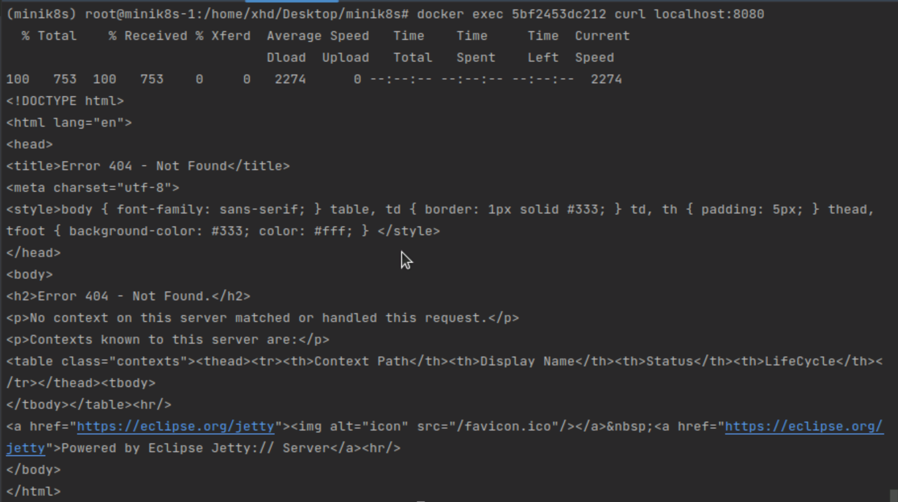

We have implemented two scheduling strategies: **random** and **round-robin**. When a node cannot be scheduled, the remaining nodes will either be selected at random or in a round-robin fashion until a suitable node is found (unsuitability may be due to CPU or memory limitations exceeding current node conditions). If no nodes are suitable, the scheduling will fail and the Pod will not be created.

### Running and Access Service with Virtual IP Address

[[Video Demonstration1]](https://drive.google.com/file/d/1D6YsYMrfjsY72842oAJ6LyMGQEcLnykr/view?usp=sharing), [[Video Demonstration2]](https://drive.google.com/file/d/1R9U5p5BDTA4q7mnDyjHFWmjcTgU8OGZa/view?usp=sharing)

Service is a virtual Kubernetes abstraction that sits on top of multiple Pods. The challenge is how to strategically forward user access to custom virtual IPs to the actual Pod IPs. We refer to Kubernetes' modifications to iptables, and have appropriately trimmed some of the filtering rules. We use the method of directly executing shell commands to write the virtual machine's iptables to achieve Service accessibility.

We can create a Service using the `kubectl` command line or the `kubectl_gui` graphical interface.

```shell
>>> start -f $/userland/final_check/service-1.yaml
$ python3 ./master/service_controller.py
```

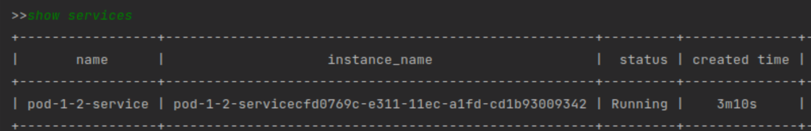

 We can demonstrate the multi-machine accessibility of a Service by requesting `ClusterIP:Port` from different virtual machines, and also from the host machine and container.

For example, we can request `192.168.88.88:88` from both the host machine and the container in `minik8s-1`.

```shell
(minik8s-1) $ curl 192.168.88.88:88
(minik8s-1) $ docker exec nginx-xxx curl 192.168.88.88:88
```

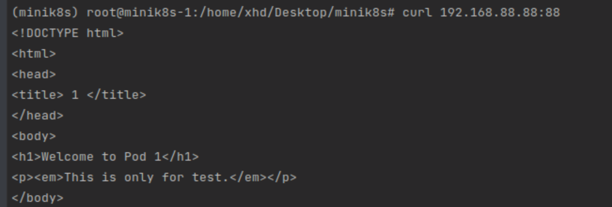

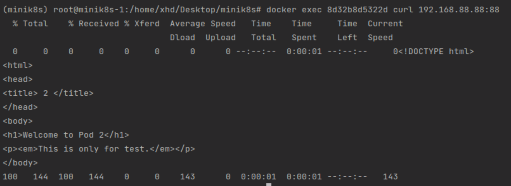

We can request `192.168.88.88:88` from both the host machine and the container in `minik8s-2`.

```shell
(minik8s-2) $ curl 192.168.88.88:88
(minik8s-2) $ docker exec nginx-xxx curl 192.168.88.88:88
```

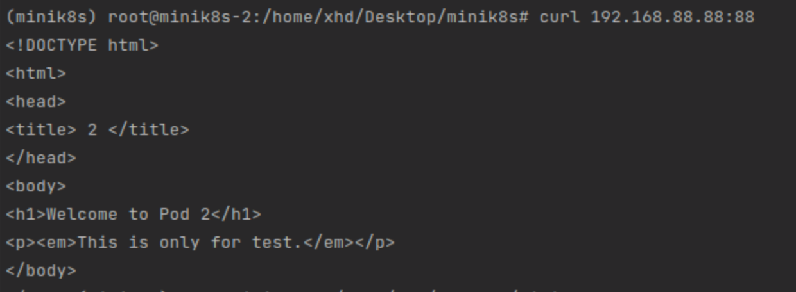

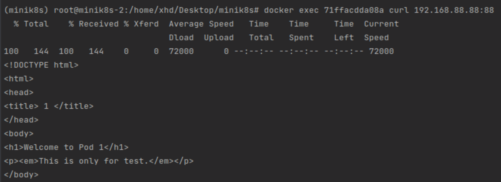

We find that we can access the corresponding Service through the virtual IP and port locally and in the container on both machines.

### Running Replica Set on Pods

[[Video Demonstration]](https://drive.google.com/file/d/1SXRhOT-Ke5MldTG6tamVN2YaAM-caUWN/view?usp=sharing)

The challenge in abstracting a ReplicaSet is how to monitor the state of the Pods. Therefore, the kubelet of each worker node sends periodic heartbeats to the API Server indicating the status of the Pods running on that node. The ReplicaSet Controller then monitors the state of the Pods and ensures that the number of replicas matches the expected value.

We can create a ReplicaSet using the `kubectl` command line or the `kubectl_gui` graphical interface. To show the current ReplicaSets and Pods, we can use the following commands:

```shell
>>> start -f $/userland/final_check/repliceset-1.yaml
>>> show replicasets
>>> show pods
```

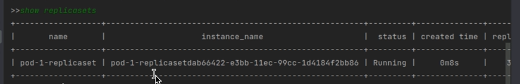

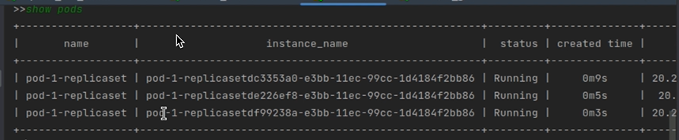

We can see that we have created three Pods. Then, we can use the `docker rm` command to remove the container maintained by one of the Pods.

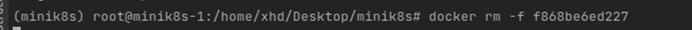

At this point, we may notice that one of the Pods is showing as "Failed", and a new Pod has just been created.

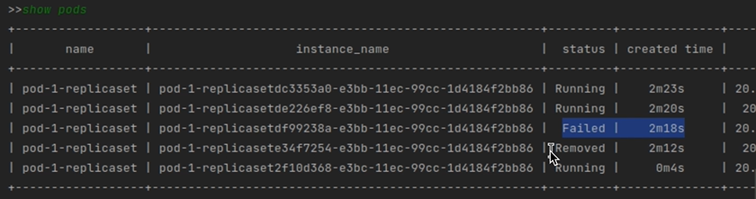

### Running Auto Scaling on Replica Set

[[Video Demonstration]](https://drive.google.com/file/d/1toe0QMIwf3dtVU1vqgfJ_DwfIuFt5h4v/view?usp=sharing)

HPA is mainly implemented based on ReplicaSet. Before the ReplicaSet Controller executes its logic, the number of replicas for the ReplicaSet corresponding to HPA will be dynamically modified based on the HPA metrics.

We can create a ReplicaSet using the graphical interface. Then, we can use the following commands to show the current HPA and Pods. At this point, four Pods have been created:

```shell
>>> start -f $/userland/yaml_default/hpa_test.yaml
```

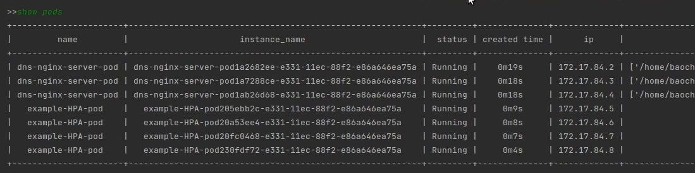

After reducing the load, we can see that the number of Pods has decreased to 3.

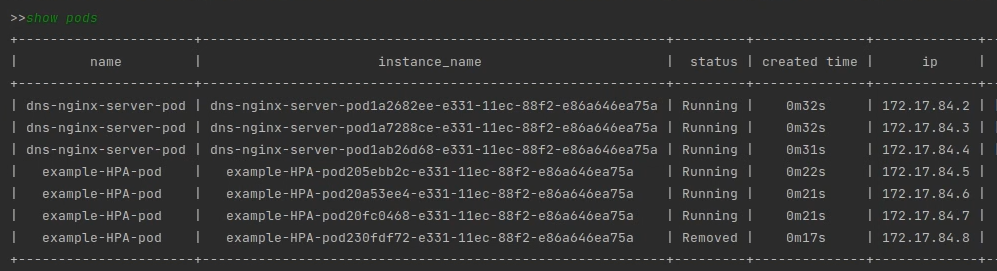

### Forwarding using DNS

[[Video Demonstration]](https://drive.google.com/file/d/1oWdrs9l345bKOv9N9F8Y1NxXHDElQFuO/view?usp=sharing)

The key to DNS forwarding is to correctly resolve the domain name to the virtual IP of the corresponding Service. To support multiple sub-paths corresponding to different Services, we set up an Nginx service as a reverse proxy.

First, we create two Services as follows:

| name | clusterIP | ports | pod |
| :--: | :--: | :--: | :--: |
| pod-1-2-service | 192.168.88.88 | 88 -> 80/tcp | pod-1, pod-2 |
| pod-3-4-5-service | 192.168.99.99 | 99 -> 80/tcp | pod-3, pod-4, pod-5 |

We used `kubelet` to create the DNS setup described above. Since we did not use a plugin for DNS forwarding and instead used an Nginx container as a reverse proxy, we essentially wrapped the Nginx forwarding into a Service and wrote the domain name and Nginx ClusterIP to the `/etc/hosts` file on the host and container. This allows requests to be routed through the Nginx reverse proxy when the host or container does not recognize the domain name.

```shell
>>> start -f $/userland/final_check/dns-1.yaml
$ python3 dns_controller.py
```

We can see that there are two DNS records, each corresponding to a different path defined in the DNS file.

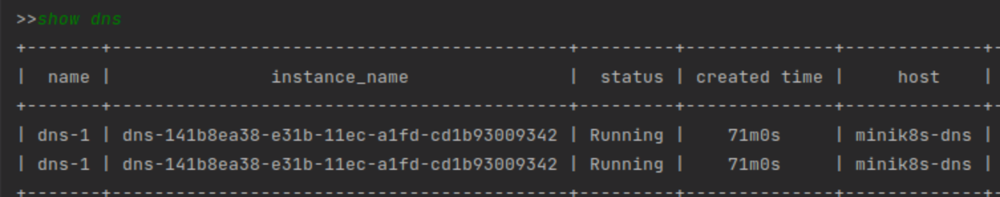

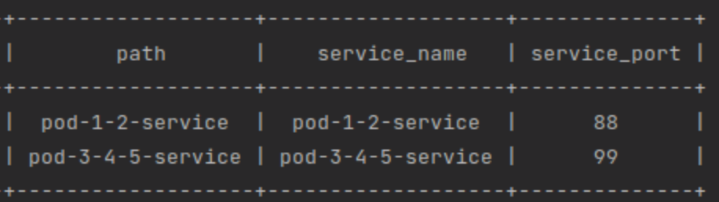

We can check in `/master/dns/nginx/conf/` and find that a `minik8s-dns.conf` file has been generated with the following contents:

```yaml
server {
  listen: 80
    server_name minik8s-dns;
    location /pod-1-2-service {
    proxy_pass http://192.168.88.88:88/;
  }
  location /pod-3-4-5-service {
    proxy_pass http://192.168.99.99:99/;
  }
}
```

Then, we can check the `/etc/hosts` files on the host and in the container to see that the relevant entries have been added.

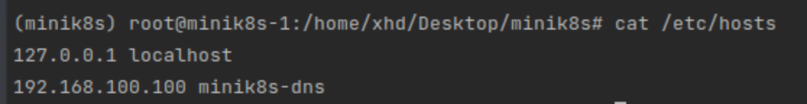

Then, we can make requests to the different paths corresponding to this domain name from both the host and container on each of the two virtual machines.

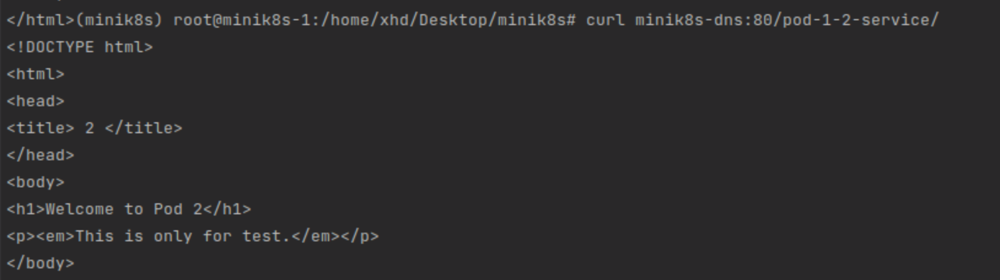

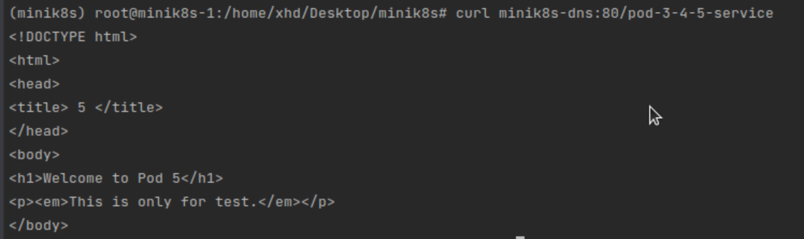

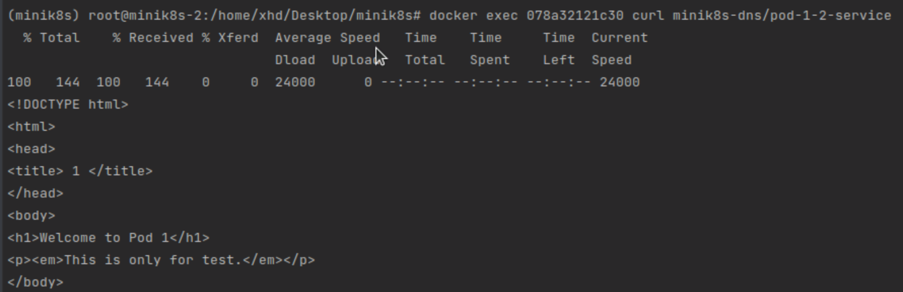

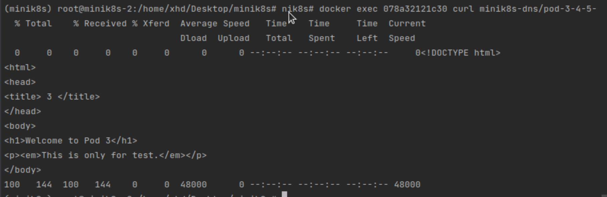

This verifies that we can access the services provided by the Services mapped to the domain name through DNS resolution and forwarding.

### Running GPU Applications

[[Video Demonstration]](https://drive.google.com/file/d/17j5XIf6pto_5NpJMW0p1pLKAz8uVBbfH/view?usp=sharing)

Firstly, we upload the `yaml` file for the job and the corresponding user CUDA file to the API Server using the following command:

```shell
>>> upload job -f ./gpu/gpu.yaml
>>> upload job -f ./gpu/data/add.cu
>>> upload job -f ./gpu/data/add.slurm
```

Then, we use a command to start and submit the job:

```shell
>>> start job add
>>> submit job add
```

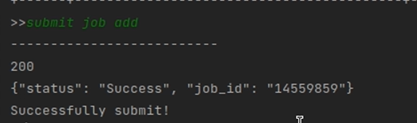

Next, we can use the following command to obtain the execution results:

```shell
download job add -f ./data
```

### Run Serverless Cloud Functions

[[Video Demonstration]](https://drive.google.com/file/d/1Ok2vJGvtlgl129gE7q5V5Yjqeu8TLUrv/view?usp=sharing)

To achieve function abstraction, we use Python Flask as the backend to receive requests forwarded by kubectl from the API Server. The format of the user-defined function is as follows:

```python
# my_module.py
def my_function(event: dict, context: dict)->dict:
    return {"result": "hello {}{}!".format(event, context)}
```

The parameters passed in the Python environment include event and context, both of which are dictionary types.

- event: Use this parameter to pass the trigger event data.
- context: Use this parameter to pass runtime information to your handler.

The return value is also a dictionary type, and the "result" field describes the actual return value.

Next, we will build the Serverless Server. Whenever a request arrives at the API Server, if the API Server finds that there is no running instance of the Serverless Server, it creates a new instance through the dockerfile; if there is a running instance, it forwards the HTTP request. 

Next, we need to wrap the `Dockerfile` according to the "my_module.py" file passed in by the user, use the `Dockerfile` to build an image. 

```dockerfile
FROM ubuntu
MAINTAINER xxx <user@example.org>
RUN DEBIAN_FRONTEND=noninteractive apt-get -y update
RUN DEBIAN_FRONTEND=noninteractive apt-get -y install python3 python3-pip
RUN pip install -r requirements.txt
RUN pip install flask
ADD ./serverless_server.py serverless_server.py
ADD ./my_module.py my_module.py
CMD ["python3","/serverless_server.py"]
```

We use the following command to build and run the image:

```bash
docker build -t serverless_test .
docker run -p 5000:5000 serverless_test
```

The results are as follows:

```bash
(base) baochen@baochen-Lenovo-Legion-Y7000-1060:~/Desktop/serverless_test$ docker run -p 5000:5000 serverless_test
 * Serving Flask app 'serverless_server' (lazy loading)
 * Environment: production
   WARNING: This is a development server. Do not use it in a production deployment.
   Use a production WSGI server instead.
 * Debug mode: off
 * Running on all addresses (0.0.0.0)
   WARNING: This is a development server. Do not use it in a production deployment.
 * Running on http://127.0.0.1:5000
 * Running on http://172.17.0.2:5000 (Press CTRL+C to quit)
```

We access the URL "http://127.0.0.1:5000/function/my_module/my_function" on the host machine, and we can see the following result:

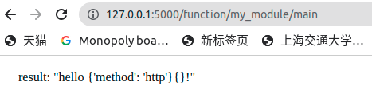

### Using Serverless DAG to Specify Transition Condition and Path

We designed a frontend for a directed acyclic graph (DAG) that supports custom serverless functions using the React framework. Users can set up functions by adding or deleting nodes and can set transition conditions along the path.


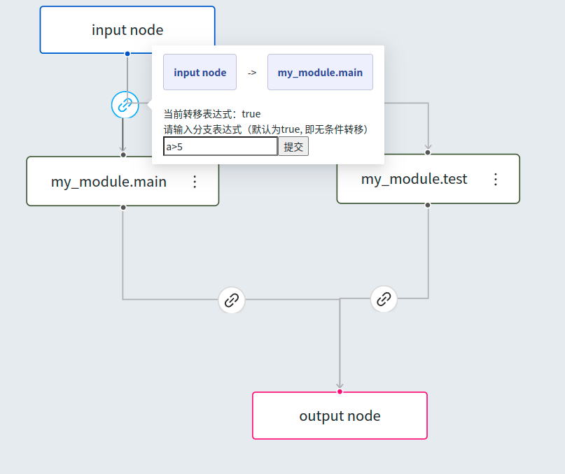

We use the following command:

```shell
>>> upload function -f ./user_serverless_scripts/add.py
>>> upload function -f ./user_serverless_scripts/multiply.py
>>> show functions
>>> trigger function serverless-add -p ./parameters/add_param.yaml
```

The parameters we passed in are `a=5, b=3`, and the `add` function will automatically add the two values together and return the result as `result`. When we make multiple requests, we find that the Serverless Server is automatically scaled out and load balanced.

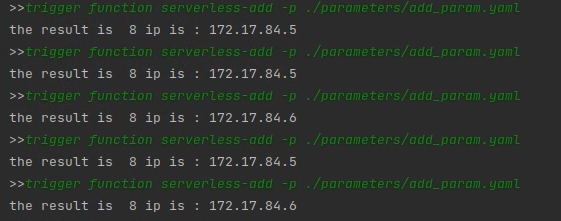

Next, we construct a Workflow in DAG_uploader as follows:

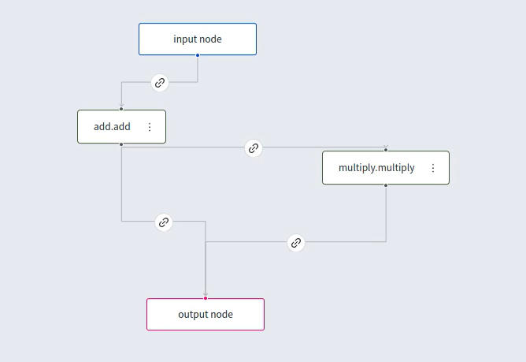

The condition for the `add.add` node to jump to the output node is `result < 11`, while the condition for jumping to the `multiply.multiply` node is `result >= 11`. We first execute the Workflow with the parameters `a=5, b=3`:

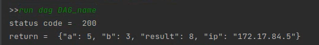

As we can see, the `add.add` node took the path where `result < 11` and output directly.

Next, we change the initial parameters and execute the Workflow with `a=5, b=7`:

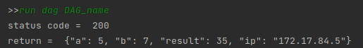

We can see that the `add.add` node, due to `result >= 11`, continued to enter the `multiply.multiply` node, and the final output is the product of the two values.

## References

[Python Docker SDK](https://docker-py.readthedocs.io/en/5.0.3/networks.html)

[Kubernetes 源码分析](https://www.bookstack.cn/read/source-code-reading-notes/kubernetes-kube_proxy_iptables.md#:~:text=kube-proxy%20%E7%BB%84%E4%BB%B6%E8%B4%9F%E8%B4%A3%E7%BB%B4%E6%8A%A4%20node%20%E8%8A%82%E7%82%B9%E4%B8%8A%E7%9A%84%E9%98%B2%E7%81%AB%E5%A2%99%E8%A7%84%E5%88%99%E5%92%8C%E8%B7%AF%E7%94%B1%E8%A7%84%E5%88%99%EF%BC%8C%E5%9C%A8%20iptables%20%E6%A8%A1%E5%BC%8F%E4%B8%8B%EF%BC%8C%E4%BC%9A%E6%A0%B9%E6%8D%AE%20service%20%E4%BB%A5%E5%8F%8A,filter%20%E8%A1%A8%E5%92%8C%20nat%20%E8%A1%A8%EF%BC%8C%E5%B9%B6%E5%AF%B9%20iptables%20%E7%9A%84%E9%93%BE%E8%BF%9B%E8%A1%8C%E4%BA%86%E6%89%A9%E5%85%85%EF%BC%8C%E8%87%AA%E5%AE%9A%E4%B9%89%E4%BA%86%20KUBE-SERVICES%E3%80%81KUBE-EXTERNAL-SERVICES%E3%80%81KUBE-NODEPORTS%E3%80%81KUBE-POSTROUTING%E3%80%81KUBE-MARK-MASQ%E3%80%81KUBE-MARK-DROP%E3%80%81KUBE-FORWARD%20%E4%B8%83%E6%9D%A1%E9%93%BE%EF%BC%8C%E5%8F%A6%E5%A4%96%E8%BF%98%E6%96%B0%E5%A2%9E%E4%BA%86%E4%BB%A5%E2%80%9CKUBE-SVC-xxx%E2%80%9D%E5%92%8C%E2%80%9CKUBE-SEP-xxx%E2%80%9D%E5%BC%80%E5%A4%B4%E7%9A%84%E6%95%B0%E4%B8%AA%E9%93%BE%EF%BC%8C%E9%99%A4%E4%BA%86%E5%88%9B%E5%BB%BA%E8%87%AA%E5%AE%9A%E4%B9%89%E7%9A%84%E9%93%BE%E4%BB%A5%E5%A4%96%E8%BF%98%E5%B0%86%E8%87%AA%E5%AE%9A%E4%B9%89%E9%93%BE%E6%8F%92%E5%85%A5%E5%88%B0%E5%B7%B2%E6%9C%89%E9%93%BE%E7%9A%84%E5%90%8E%E9%9D%A2%E4%BB%A5%E4%BE%BF%E5%8A%AB%E6%8C%81%E6%95%B0%E6%8D%AE%E5%8C%85%E3%80%82)

[Kubernetes Services Networking](https://docs.openstack.org/kuryr-kubernetes/latest/installation/services.html)

[Kubernetes Service 类型介绍](https://blog.csdn.net/Aimee_c/article/details/106964337)

[iptables 规则初学](https://www.howtogeek.com/177621/the-beginners-guide-to-iptables-the-linux-firewall/)

[iptables 官方文档](https://linux.die.net/man/8/iptables)

[Kubernetes Flannel](https://kubernetes.feisky.xyz/extension/network/flannel)

[Prometheus](https://prometheus.io/docs/prometheus/latest/installation/)

[Nginx](https://nginx.org/en/docs/http/server_names.html)

[Docker 网络](https://docs.docker.com/network/)

[Kubernetes Service](https://kubernetes.io/zh/docs/concepts/services-networking/service/)

https://level-up.one/category/kubernetes/

https://matthewpalmer.net/kubernetes-app-developer/articles/kubernetes-networking-guide-beginners.html

https://zhuanlan.zhihu.com/p/90992878

https://blog.csdn.net/qq_41861526/article/details/97621144

https://www.velotio.com/engineering-blog/flannel-a-network-fabric-for-containers

https://cloud.tencent.com/developer/article/1603511

https://dustinspecker.com/posts/iptables-how-kubernetes-services-direct-traffic-to-pods/

https://mvallim.github.io/kubernetes-under-the-hood/documentation/kube-flannel.html

https://docker-k8s-lab.readthedocs.io/en/latest/docker/docker-flannel.html
